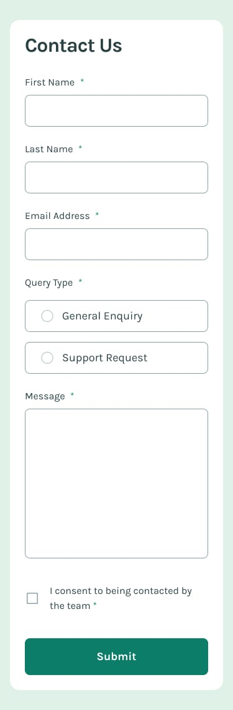

# Frontend Mentor - Contact form solution

This is a solution to the [Contact form challenge on Frontend Mentor](https://www.frontendmentor.io/challenges/contact-form--G-hYlqKJj).

## Table of contents

- [Overview](#overview)
  - [Screenshot](#screenshot)
  - [Links](#links)
- [My process](#my-process)
  - [Built with](#built-with)
  - [What I learned](#what-i-learned)
  - [Continued development](#continued-development)
- [Author](#author)

---

## Overview

### Screenshot

|  |  |
| :--: | :--: |
| Desktop | Mobile |

### Links

- Solution URL: [Frontend Mentor](https://www.frontendmentor.io/solutions/contact-form-uUfTqap306)
- Live Site URL: [GitHub Pages](https://rahulpaul127.github.io/contact-form/)

---

## My process

### Built with

- Semantic HTML5 markup
- CSS custom properties
- CSS Flexbox & CSS Grid
- Mobile-first responsive workflow
- Vanilla JavaScript for form validation and DOM manipulation

### What I learned

- **Form Validation**: Implemented robust client-side validation using vanilla JavaScript, including checking for empty fields, validating email formats using Regular Expressions (Regex), and ensuring radio buttons and checkboxes are selected.
- **Custom Form Controls**: Created custom styled radio buttons and checkboxes to match the specific design requirements, utilizing CSS and visually hiding the default inputs while maintaining functionality.
- **Dynamic Error Handling**: Dynamically applying and removing CSS classes (`.error`) to show or hide inline error messages and update input border colors based on validity in real-time.
- **Toast Notifications**: Built a custom, animated toast notification that smoothly slides into view upon successful form submission and automatically dismisses after a set duration.
- **Real-time Feedback**: Improved user experience by clearing error states in real-time as the user starts typing or interacting with the inputs, rather than waiting for another form submission.

### Continued development

- Add the final deployed links after publishing the project.
- Implement more detailed accessibility enhancements, such as `aria-invalid` and better screen reader announcements for form validation errors.
- Explore adding subtle entrance animations for the form fields when the page loads.

## Author

- Frontend Mentor - [@rahulpaul127](https://www.frontendmentor.io/profile/rahulpaul127)
- Twitter - [@rahulpaul127](https://x.com/rahulpaul127)
